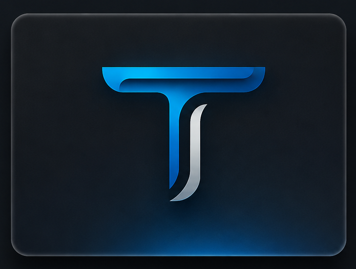

 

## 👨‍💻 Sobre mim

Sou **formado em Ciência da Computação** e desenvolvedor **Full Stack**, com foco no desenvolvimento de aplicações web completas, atuando desde a construção de interfaces até a implementação de APIs, regras de negócio, autenticação e persistência de dados.

Tenho experiência prática com **Next.js, React, TypeScript e Node.js**, além de trabalhar com **PostgreSQL, Prisma, Supabase e Docker** no desenvolvimento e estruturação de aplicações.

Meu foco profissional é atuar como desenvolvedor **Full Stack**, aplicando boas práticas de desenvolvimento, organização de código e arquitetura para construir aplicações funcionais, escaláveis e de fácil manutenção.

Neste GitHub, apresento projetos que demonstram minha experiência prática com desenvolvimento **Frontend e Backend**, integração de serviços, bancos de dados e construção de aplicações web completas.

---

## 🚀 Tecnologias e Ferramentas

### 🖥️ Frontend

      

### ⚙️ Backend & Banco de Dados

     

### 🛠️ Ferramentas

     

---

## 📌 Projetos em Destaque

### 🏢 N&H Associados

  

**Plataforma desenvolvida para captação, gerenciamento e distribuição de leads para corretores de planos de saúde.**

  

   

  

---

### 💈 BarberHub

  

**Sistema Full Stack desenvolvido para centralizar o gerenciamento de clientes, profissionais, serviços e agendamentos de uma barbearia.**

  

   

  

---

### 🌐 Tecnoz Hub

  

**Plataforma web desenvolvida para apresentar conteúdos e informações relacionadas ao universo da tecnologia.**

  

   

  

## 📫 Contato

 

### Obrigado por visitar

 

